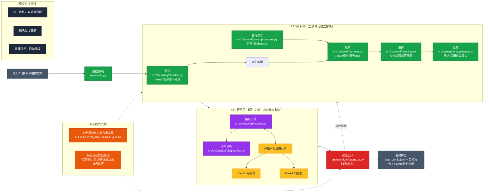
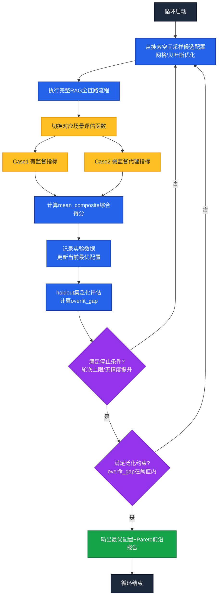
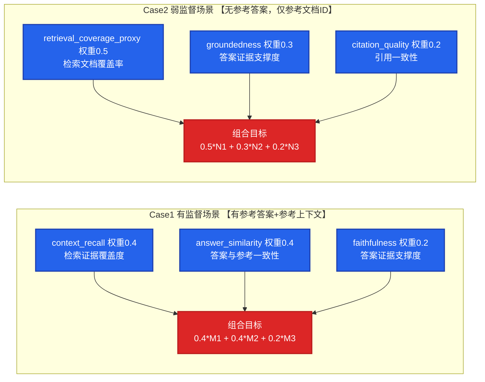

# RAG 优化器（rag_optimizer）

## 1. 项目简介

`rag_optimizer` 是一个面向 RAG 流水线的自动化配置优化工具。它支持两类评估场景：

- **Case1（有监督）**：有参考答案与参考上下文
- **Case2（弱监督）**：无参考答案，仅有查询与参考文档映射

## 2. 架构说明

### 2.1 系统定位与整体架构

本系统是一个**面向 RAG 流水线的自动化配置优化器**，核心能力为：

- **统一优化内核**：同一优化器可切换 Case1/Case2 目标函数
- **模块化流水线**：chunking / retrieval / reranking / generation 可独立替换
- **多种搜索方式**：支持网格搜索、随机搜索与贝叶斯搜索（Optuna）
- **可观测结果输出**：自动生成 `best_config.json`、`run_summary.csv`、`per_query_diagnostics.csv`、Pareto 前沿文件
- **离线优先**：在线增强组件不可用时，自动降级，保证主流程可运行

**核心总览架构图：**




### 2.2 优化循环与评估指标

**实验循环流程图：**




**双场景评估指标对比：**




**配置选择规则：**

- 主目标：`mean_composite` 最大化
- 泛化约束：优先 `overfit_gap` 小的配置（holdout 稳定）
- 多目标：Pareto 前沿（质量 vs 延迟）默认每次自动生成

### 2.3 模块职责与框架借鉴


| 层    | 职责                                   | 文件                                 | 框架借鉴                                             |
| ---- | ------------------------------------ | ---------------------------------- | ------------------------------------------------ |
| 数据加载 | 读取语料、评估集                             | `src/utils/io.py`                  | —                                                |
| 分块   | token / sentence / semantic 三种策略     | `src/chunking/chunker.py`          | —                                                |
| 检索   | BM25 / dense / hybrid（RRF 融合）        | `src/retrieval/retriever.py`       | **FlashRAG**：`_rrf_merge()`自实现 RRF（k=60）         |
| 重排   | cross-encoder 可配置                    | `src/retrieval/reranker.py`        | —                                                |
| 查询改写 | expand / decompose / HyDE            | `src/retrieval/query_processor.py` | **DSPy**：`QuerySignature`+`QueryModule` 声明式结构    |
| 生成   | concise / citation_first 两种模式        | `src/generation/generator.py`      | —                                                |
| 指标评估 | Case1/Case2 双场景，支持 BERTScore/RAGAS   | `src/evaluation/metrics.py`        | —                                                |
| 诊断分析 | RAGChecker 风格三项诊断 + LLM-as-Judge 接地性 | `src/evaluation/diagnostics.py`    | **LightRAG**：实体元数据注入 `_detect_entities()`        |
| 优化循环 | 搜索空间枚举 + Pareto 多目标分析                | `src/optimizer/optimizer.py`       | **AutoRAG**：`_iter_configs()`/`_run_case()` 评估闭环 |


> 四个框架借鉴均为自实现核心算法，不依赖原框架包，完整透明可离线运行（详见第 9 节）。

### 2.4 失败模式与处理策略


| 失败类型    | 诊断信号                                                        | 处理策略                                             |
| ------- | ----------------------------------------------------------- | ------------------------------------------------ |
| 检索覆盖不足  | `context_recall` / `retrieval_coverage_proxy` 过低            | 调整 chunk size / overlap / top_k；启用 query rewrite |
| 答案幻觉    | `faithfulness` / `groundedness` 低；`hallucination_risk=high` | 开启 reranker；采用 `citation_first` 生成样式             |
| 外部模型不可用 | dense / BERTScore / cross-encoder 加载失败                      | 自动降级为 TF-IDF / token overlap，主流程不中断              |
| 过拟合     | `overfit_gap` 偏大                                            | 收缩搜索空间；调整指标权重；增加 holdout 比例                      |


---

## 3. 环境依赖

- Python 3.10+

安装依赖：

```bash
pip install -r requirements.txt
```

---

## 4. 数据格式

### 4.1 `reference_corpus.jsonl`

每行一个 JSON 文档，至少包含：

- `doc_id`
- `text`

可选字段：`title`, `source`, `page_number`

### 4.2 `case1_eval_dataset.csv`

至少包含列：

- `query_id`
- `query`
- `reference_doc_ids`（`|` 分隔）
- `reference_answer`
- `reference_relevant_context`

### 4.3 `case2_query_doc_dataset.csv`

至少包含列：

- `query_id`
- `query`
- `reference_doc_ids`（`|` 分隔）

---

## 5. 运行方式

### 5.1 基础命令

```bash
# 运行 Case1 + Case2
python main.py

# 仅运行 Case1
python main.py --case 1

# 仅运行 Case2
python main.py --case 2

# 限制每个 Case 的实验次数
python main.py --max-trials 10
```

### 5.2 可选参数

- `--case {1,2}`：只运行某个 case；不填则两个 case 都运行
- `--max-trials`：每个 case 最大实验次数
- `--top-k`：每次检索返回块数
- `--config`：配置文件路径
- `--data-dir`：数据目录
- `--output-dir`：输出目录

### 5.3 LLM 真实调用优先 + 兜底机制

本项目默认支持**免费开源本地 LLM（Ollama）**，真实调用失败时自动兜底。

推荐（面试项目）默认使用本地开源模型：

```bash
# 本地 Ollama
set RAG_OPT_LLM_MODEL=qwen2.5:7b-instruct
set RAG_OPT_OLLAMA_BASE_URL=http://127.0.0.1:11434
```

外部调用日志在运行时直接输出到终端。
可通过 `status=start/success/fallback/error` 快速判断是否连通。

---

## 6. 配置说明

配置文件：`config/optimizer_config.json`

### 6.1 搜索空间

- `search_space.chunking`
  - `strategy`, `size`, `overlap_type`, `overlap_size`
  - `semantic_min_size`, `semantic_max_size`
  - `window_size`, `similarity_threshold`
  - `preserve_table_as_markdown`, `generate_image_caption`
- `search_space.retrieval`
  - `retriever`, `embedding_model`
  - `metadata_filter_enabled`, `metadata_enrichment`, `metadata_filter_fields`
- `search_space.query_processor`
  - `rewrite`, `decompose`, `intent_driven_filter`
- `search_space.reranking`
  - `enabled`, `model`
- `search_space.generation`
  - `answer_style`, `temperature`

### 6.2 目标函数权重

- `objective.case1_weights`
  - `context_recall`, `answer_similarity`, `faithfulness`, `answer_relevancy`, `context_relevancy`
- `objective.case2_weights`
  - `retrieval_coverage_proxy`, `groundedness`, `citation_quality`, `answer_relevancy`, `context_relevancy`
- `objective.judge_weight`
  - 将 `judge_score` 以小权重并入最终 `composite`（默认 0.03）

这些权重会在 `metrics.py` 与 `optimizer.py` 中参与 composite 加权计算。

### 6.3 运行配置

- `run.search_method`：`grid` / `random` / `bayes`
- `run.cache_enabled`：是否启用缓存
- `run.use_ragas` / `run.use_bertscore` / `run.use_llm_judge` / `run.use_llm_generator`：是否启用增强评估与生成
- `run.mlflow_tracking_uri`：MLflow Tracking URI（建议 `sqlite:///outputs/mlflow.db`，避免 filesystem backend 弃用警告）
- `run.llm_model`：模型名称（如 `qwen2.5:7b-instruct`）
- `run.ragas_min_usage_threshold`：RAGAS 有效使用率阈值（低于阈值触发信号守卫）
- `run.ragas_guard_mode`：`invalid`（trial 直接无效）或 `penalty`（强惩罚）
- `run.ragas_guard_penalty`：`penalty` 模式下的降权系数

---

## 7. 如何对比优化（Case1 vs Case2）

本节说明同一优化器在案例 1 和案例 2 中的行为差异，以及如何进行对比分析。

### 7.1 对比目标

- **Case1（有监督）**：目标是提升“答案质量 + 证据一致性”
  - 关键指标：`context_recall`、`answer_similarity`、`faithfulness`
- **Case2（弱监督）**：目标是提升“检索覆盖 + 证据绑定 + 引用质量”
  - 关键指标：`retrieval_coverage_proxy`、`groundedness`、`citation_quality`
  核心区别：Case1 直接依赖参考答案进行质量约束，Case2 不依赖参考答案，更关注证据覆盖和可落证性。

### 7.2 优化器行为差异（重点）

1. **评分函数不同**

- Case1 在 `case1_metrics` 路径打分，强调答案与参考答案的一致性。
- Case2 在 `case2_metrics` 路径打分，强调检索命中与答案是否被上下文支持。

1. **最优配置偏好不同**

- Case1 更容易偏好能提升答案相似度的配置（例如更稳的重排、较保守的生成参数）。
- Case2 更容易偏好能提升覆盖率与 groundedness 的配置（例如检索召回更高或更利于引用的组合）。

1. **风险信号关注点不同**

- Case1 更敏感于答案偏差（`answer_similarity` 下降）。
- Case2 更敏感于证据不足或引用不一致（`retrieval_coverage_proxy` / `citation_quality` 下降）。

1. **权重来源不同**

- Case1 使用 `objective.case1_weights`。
- Case2 使用 `objective.case2_weights`。
- 两者的权重与来源会被记录到 `run_summary.csv` 与 `best_config.json`，可直接追踪。

### 7.3 如何做对比优化（推荐步骤）

1. 使用同一数据版本、同一搜索方法（`grid` 或 `bayes`）分别运行 Case1 与 Case2。
2. 对比 `outputs/run_summary.csv` 中两个 case 的：
  - `mean_composite`
  - 最优配置参数（retriever/chunk/rerank/query_processor）
  - `objective_weight_source` 与 `objective_weights`
3. 对比 `outputs/best_config.json` 的 `case1` 与 `case2`：
  - `train_score`、`holdout_score`、`overfit_gap`
4. 结合 `per_query_diagnostics.csv` 观察失败模式：
  - Case1 侧重答案偏差
  - Case2 侧重证据覆盖与引用质量

### 7.4 对比结论应如何解读

- 若 Case1 高、Case2 低：通常表示答案质量可控，但检索覆盖或引用链路仍需加强。
- 若 Case2 高、Case1 低：通常表示证据链较完整，但生成答案与参考答案一致性不足。
- 若两者都高：说明当前配置在监督与弱监督场景下均具备较好稳定性。

---

## 8. 输出文件

统一输出到 `outputs/`：

1. `best_config.json`：每个 case 的最优配置与分数（含权重追踪字段）
2. `run_summary.csv`：每次实验的配置、分数、耗时等汇总
3. `per_query_diagnostics.csv`：逐 query 指标与诊断结果
4. `pareto_frontier_case{1|2}.csv`：质量-延迟 Pareto 前沿
5. `retrieval_examples/`：检索样例
6. `answer_examples/`：答案样例
7. `final_report.md`：最终总结报告

---

## 9. 框架借鉴说明（AutoRAG / DSPy / FlashRAG / LightRAG）

> 本项目已在代码层面真实借鉴四个框架的核心思想，非黑盒调用。

### 9.1 AutoRAG — 评估驱动的 Pipeline 搜索

**已在代码中实现（`src/optimizer/optimizer.py`）：**

- `_iter_configs()` / `_sample_config_by_trial()`：枚举所有超参组合（网格或贝叶斯）
- `_run_case()`：每个候选配置执行完整 RAG 流程，返回 `mean_composite`（评估闭环）
- 多目标 Pareto 分析：每次运行自动输出 `pareto_frontier_case{n}.csv`，质量-延迟权衡

**非黑盒说明：** 不依赖 autorag 包；搜索与评估逻辑完全自实现，搜索空间通过配置文件显式定义。

### 9.2 DSPy — 声明式查询程序

**已在代码中实现（`src/retrieval/query_processor.py`）：**

- `QuerySignature` 数据类：声明任务名称、输入/输出字段语义、执行策略
- `QueryModule.forward()`：执行逻辑与声明解耦，规则实现完全透明
- 三种预定义 Signature：`EXPAND_SIG` / `DECOMPOSE_SIG` / `HYDE_SIG`
- 生产替换：只需修改 `forward()` 内部为 LLM 调用，接口不变

**非黑盒说明：** 不引入 `dspy` 包；若接入 LLM 改写，建议先在验证集对比改写前后 `context_recall` 变化。

### 9.3 FlashRAG — 标准化检索接口 + RRF 融合

**已在代码中实现（`src/retrieval/retriever.py`）：**

- `_rrf_merge()`：完整实现 RRF 算法（`score(d) = sum(1/(k+rank_i(d)))`，k=60）
- hybrid 模式：BM25 + dense 双路各自排序后 RRF 融合，非简单加权平均
- 统一接口：`bm25` / `dense` / `hybrid` 三种模式共享相同调用签名

**非黑盒说明：** 不依赖 FlashRAG 包；RRF 实现约 20 行，逻辑完全透明，支持离线降级。

### 9.4 LightRAG — 实体感知元数据注入

**已在代码中实现（`src/retrieval/retriever.py`）：**

- `_detect_entities()`：构建索引时检测领域关键词，注入 `chunk.metadata["entities"]`
- `_DOMAIN_ENTITIES` 词典：覆盖 kyc/aml/fee/credit/fraud/sanctions/pii 等金融实体
- `retrieve()` metadata_filter：支持按实体类别过滤候选集，模拟图谱关联查询入口
- `optimizer.py` 中 metadata_filter 已改为字段感知规则：根据 `metadata_filter_fields` 从 query 自动匹配候选 metadata 值（非 kyc/fee 硬编码）
- 生产替换：将 `_detect_entities()` 换为 spaCy / transformers NER，接口不变

### 9.5 裁判模型（LLM-as-Judge）接地性检查

**已在代码中实现（`src/evaluation/diagnostics.py`）：**

- `judge_groundedness_score()`：统一接地性评分接口，**真实 LLM 调用优先，代理评分兜底**
- 当前默认 provider：`ollama`（免费开源本地模型）
- 输出到 `per_query_diagnostics.csv`：`judge_score` / `judge_method` / `judge_warning`
- 外部调用事件在运行时直接输出到终端（`start/success/fallback`）

**防止“虚假信号”说明：**

- `metrics.py` 新增 `signal_quality`，用于标记真实评估信号占比
- `optimizer.py` 新增 signal guard：当 `ragas_used` 低于阈值可直接判无效或强惩罚
- 当全部 trial 被 guard 判无效时，自动回退到 `raw_mean_composite` 最优配置，保证报告可读性

---

## 10. 实现说明

本项目在代码层实现并融合了多种常见 RAG 优化思路，包括：

- 评估驱动的配置搜索
- 声明式查询处理
- 混合检索与 RRF 融合
- 实体感知 metadata 注入

实现以可读、可替换、可离线复现为目标。